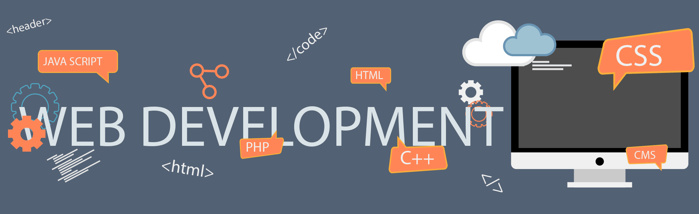

<h1 align="center">Hi 👋, I'm Abu Khalid Rifat</h1>
<h3 align="center">Full Stack Web Developer | Wordpress theme developer</h3>

 

  

- 🌱 I’m currently learning **React native**

- 👨‍💻 All of my projects are available at <a alt="rifat web dev website" href="https://akrifat.netlify.app" target="_blank"><strong>my portfolio</strong></a>

- 💬 Ask me about **javascript, react, node, express**

- 📫 How to reach me **abukhalidrifat99+gh@gmail.com**
<h3 align="left">Connect with me:</h3>

<h3 align="left">Languages and Tools:</h3>

 
   
  
  
  
  
    
     
   
   
   
    
    
     
    
    
     
  <br/
   
   
   
  
  
  
  

